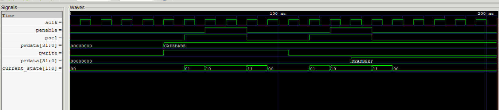

# AMBA-Compliant AXI-Lite to APB4 Bridge

A robust hardware protocol converter designed in **Verilog HDL** to bridge high-performance **AXI-Lite masters** with low-power, simple **APB4 peripheral subsystems**.

---

## 📘 Protocol Specification Compliance

This IP module is designed and verified to be strictly compliant with official ARM architectural specifications:

- **AMBA AXI4-Lite (ARM IHI 0022E):**
  - Implements the `AW`, `W`, `B`, `AR`, and `R` channels.
  - Uses structurally decoupled source/destination handshakes to eliminate combinational loops (Section A3.1.2).

- **AMBA APB4 (ARM IHI 0024C):**
  - Adheres to the standard 3-phase state machine flow:
    ```
    IDLE → SETUP → ACCESS
    ```
  - Guarantees `psel` asserts exactly one clock cycle before `penable` (Section 2.1).

---

## 🛡️ Design Architecture & Safety

- **Glitch-Free FSM:** Built utilizing a deterministic 4-state sequential machine (`00 → 01 → 10 → 11`).
- **X-Propagation Prevention:** Features explicit default assignments and strict synchronous/asynchronous reset domains (`aresetn`) to guarantee no uninitialized or metastable states propagate through logic fabrics at startup.

---

## 📊 Verification Toolchain & Simulation

The design has been verified through testbench transaction coverage using open-source tools:

- **Compiler/Simulator:** Icarus Verilog (`iverilog` / `vvp`)
- **Waveform Viewer:** GTKWave

### Simulation Output Log

```text
VCD info: dumpfile simulation_waves.vcd opened for output.

[TIME: 40000 ns] STARTING WRITE OPERATION...
[TIME: 105000 ns] WRITE TRANSFERRED TO APB BUS
[TIME: 105000 ns] STARTING READ OPERATION...
[TIME: 185000 ns] READ COMPLETE!

=============================================
  SIMULATION RUN COMPLETED SUCCESSFULLY!
=============================================
```

---

## 📈 Waveform Performance Analysis


Functional verification shows clean back-to-back operations without interface stalls.

### Write Transaction (40 ns – 90 ns)

- Successful bridge capture of write data `pwdata = 32'hCAFEBABE` during the APB setup-to-access transition phase.

### Read Transaction (110 ns – 170 ns)

- Clean bridge sampling of peripheral read data `prdata = 32'hDEADBEEF` back into the system master domain.

---

## 👤 Author

**Chetan Chaudhary**

**Hardware Developer**

**Institution:** National Institute of Technology (NIT), Silchar
